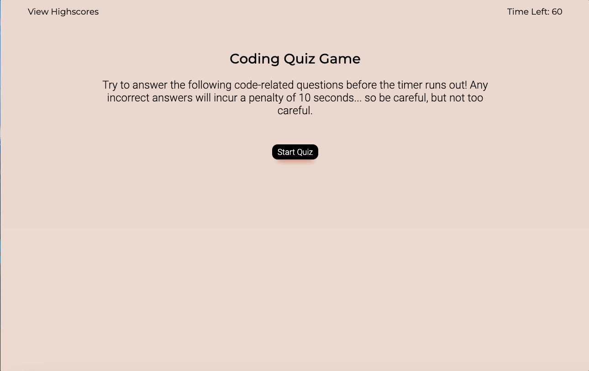

# Timed Coding Quiz

## Table of Contents

- [Criteria](#criteria)
- [Overview](#overview)
- [Built With](#built-with)
- [Acknowledgements](#acknowledgements)

## Description
For this project we were required to build an interactive quiz application. The purpose of this task was to prepare us for potential coding assessments or challenges we may be required to complete in the future as part of an interview process. 

This challenge provided the opportunity to implement what we have learned this past week, furthering the development of our JavaScript skills.

The timed quiz has to be composed of multiple choice questions and run in the browser, featuring dynamically updated HTML AND CSS powered by JavaScript that we write, no starter code provided. It must also have a a clean, polished, and responsive user interface.


## Criteria
```
GIVEN I am taking a code quiz
WHEN I click the start button
THEN a timer starts and I am presented with a question
WHEN I answer a question
THEN I am presented with another question
WHEN I answer a question incorrectly
THEN time is subtracted from the clock
WHEN all questions are answered or the timer reaches 0
THEN the game is over
WHEN the game is over
THEN I can save my initials and my score
```


## Overview
 Overall, only having minimal knowledge of the language and not being familiar with its capabilities proved to be quite the challenge... but I really got into a roll towards the end of it. A large portion of this project was trial and error... I'd try implementing new techniques (some attempts were based off what we learnt in class and others fell short of even an educated guess) for hours, back and forth, until I came to a solution.

 It drove me a little bonkers BUT we got there in the end and it helped get me a lot more comfortable with JS.

Top Tip: just try again ... and again and again... eventually it will click.


### Final Outcome
View my deployed application [here](https://jayabaldwin.github.io/timed-code-quiz/)

The following animation displays the applications functionality:




### Built With
- JavaScript
- HTML
- CSS
- VS Code


## Acknowledgements
- Assistance from my tutor Anastasia Warren
- Help from various tutors through AskBCS Learning Assistant on Slack
- Inspiration from prior student's [work](https://github.com/mmeii/code-quiz)
- All other information gained from revising class work, no tutorials this time